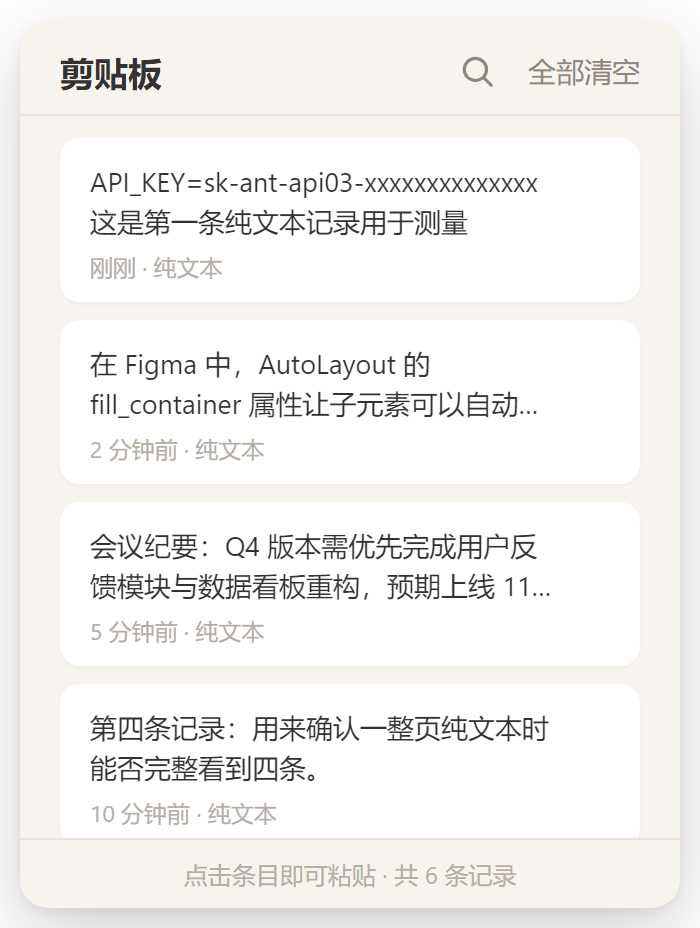
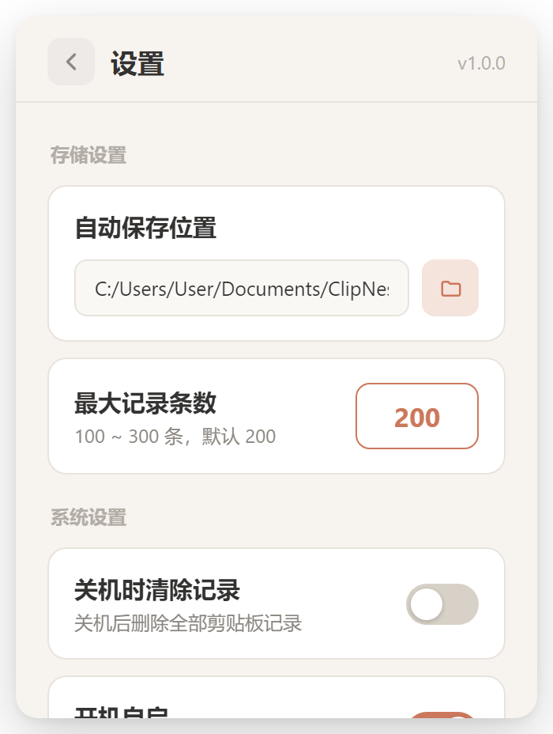

# Pasteboard

> 常驻后台、极省内存的 Windows 增强剪贴板。基于 **Tauri v2**（Rust + 系统 WebView2）实现，常驻内存约 30–40&nbsp;MB。

Windows 自带剪贴板历史只能存 20 条、不能持久化、不能管理图片。Pasteboard 把它换成一个能存 **200+ 条历史、自动捕获文本 / 链接 / 截图、点击即粘贴**的轻量工具，按一下全局热键就在光标旁弹出。

<p align="center">
  
  &nbsp;&nbsp;
  
</p>

## ✨ 特性

- **自动捕获** —— 复制文本、链接、截图（如 `Win+Shift+S`）自动入列，分别标记「纯文本 / 链接 / 截图」。
- **大容量历史** —— 默认 200 条（可设 100–300），SQLite 持久化；大图落盘，库内只存路径，内存不膨胀。
- **全局热键** —— 默认 `Alt+V`，在光标右下方弹出，自动做屏幕边界检测，多显示器可用。
- **点击即粘贴** —— 点条目即把内容写回剪贴板并模拟 `Ctrl+V` 粘贴到当前焦点处，该条自动置顶。
- **条目管理** —— 每条支持「固定（置顶）/ 删除 / 保存到磁盘」。
- **系统托盘** —— 左键唤起剪贴板，右键菜单：设置 / 剪贴板 / 退出。
- **设置选项** —— 开机自启（静默后台）、关机时清除非固定记录。
- **轻量** —— 复用系统 WebView2，使得占用内存在30MB左右。

## 🧱 技术栈

| 层 | 用到的东西 |
| --- | --- |
| 框架 | Tauri v2（Rust 核 + 系统 WebView2 渲染前端） |
| 存储 | rusqlite（内置 SQLite，零外部依赖）+ 大图落盘 |
| 剪贴板 | clipboard-master（监听变化）、arboard（读写文本/图片） |
| 粘贴注入 | enigo（模拟 `Ctrl+V`） |
| 图片 | image（生成缩略图）、base64（缩略图转 data URI 给前端） |
| 系统能力 | windows（光标定位 / 工作区边界）、global-shortcut / autostart / dialog 插件 |
| 前端 | 原生 HTML / CSS / JS（无构建步骤），Claude 暖米白 + 铜橙配色 |

## 🚀 安装使用

1. 下载安装包 `Pasteboard_1.0.0_x64-setup.exe` 并运行。
   - 首次安装若系统缺少 **WebView2 Runtime**，安装器会自动引导下载（Windows 11 自带，Windows 10 多数已预装）。
2. 安装后程序常驻系统托盘（默认开机自启，静默后台）。

日常操作：

| 操作 | 方式 |
| --- | --- |
| 唤起 / 收起面板 | 按 `Alt+V`（可在设置里改） |
| 粘贴某条记录 | 点击该卡片 |
| 固定 / 删除 / 保存 | 卡片右上角「⋯」菜单 |
| 全部清空 | 面板右上角「全部清空」 |
| 打开设置 | 托盘图标右键 → 设置 |
| 退出程序 | 托盘图标右键 → 退出 |

## 🛠️ 本地开发与构建

### 环境要求

- **Windows 10 / 11**（x64）
- **Rust**（stable，MSVC toolchain）—— 用 [rustup](https://rustup.rs/) 安装
- **MSVC 生成工具** —— Visual Studio Build Tools，勾选「使用 C++ 的桌面开发」
- **Node.js ≥ 18**（仅用于跑 Tauri CLI）
- **WebView2 Runtime** —— Windows 10 需手动装一次（[下载](https://developer.microsoft.com/microsoft-edge/webview2/)），Windows 11 自带

### 步骤

```bash
# 1. 安装前端依赖（仅 Tauri CLI）
npm install

# 2. 开发模式：启动应用，托盘常驻，改 Rust 代码自动重编
npm run dev

# 3. 打包：产出 release 主程序 + NSIS 安装包
npm run build
```

构建产物：

- 主程序：`src-tauri/target/release/pasteboard-v2.exe`
- 安装包：`src-tauri/target/release/bundle/nsis/Pasteboard_1.0.0_x64-setup.exe`

> ⚠️ `npm run dev` 只热重载 `src-tauri/`（Rust）。修改 `ui/` 下的前端文件后需要**重启**应用才能看到变化。
>
> 💡 若 `cargo` 拉取依赖超时，可加重试参数：`CARGO_NET_RETRY=10 CARGO_HTTP_TIMEOUT=120 npm run build`。

## 📂 项目结构

```
pasteboard_v2/
├─ ui/                     # 前端（frontendDist），无构建步骤
│  ├─ index.html           # 剪贴板视图 + 设置视图
│  ├─ styles.css           # 设计 token 与样式
│  └─ app.js               # invoke 调用、事件监听、交互逻辑
├─ src-tauri/
│  ├─ tauri.conf.json      # 窗口 350×464、无边框、透明、托盘隐藏、置顶
│  ├─ Cargo.toml
│  └─ src/
│     ├─ lib.rs            # 入口：装配插件 / 托盘 / 热键 / 监听 / 窗口事件
│     ├─ db.rs             # SQLite 建表、CRUD、排序、容量裁剪
│     ├─ settings.rs       # JSON 配置读写与默认值
│     ├─ state.rs          # 全局 AppState
│     ├─ clipboard.rs      # 剪贴板监听 + 去重 + 落盘缩略图 + 写库
│     ├─ tray.rs           # 系统托盘图标与菜单
│     ├─ hotkey.rs         # 全局热键注册 / 重注册 / 触发
│     ├─ window.rs         # 光标定位 + 多屏边界检测
│     ├─ paste.rs          # 写回剪贴板 + 模拟 Ctrl+V
│     └─ commands.rs       # 暴露给前端的 #[tauri::command]
└─ package.json            # Tauri CLI 脚本（dev / build）
```

## ⚙️ 配置与数据位置

| 内容 | 位置 |
| --- | --- |
| 配置文件 `settings.json` | `%APPDATA%\com.pasteboard.v2\` |
| 数据库 `pasteboard.db`、缩略图、原图 | `%APPDATA%\com.pasteboard.v2\` |
| 「保存」导出目录（默认） | `%USERPROFILE%\Documents\ClipNest` |

默认配置：最大记录 200 条（可设 100–300）、关机清除关闭、开机自启开启、热键 `Alt+V`。

## 📜 License

MIT
